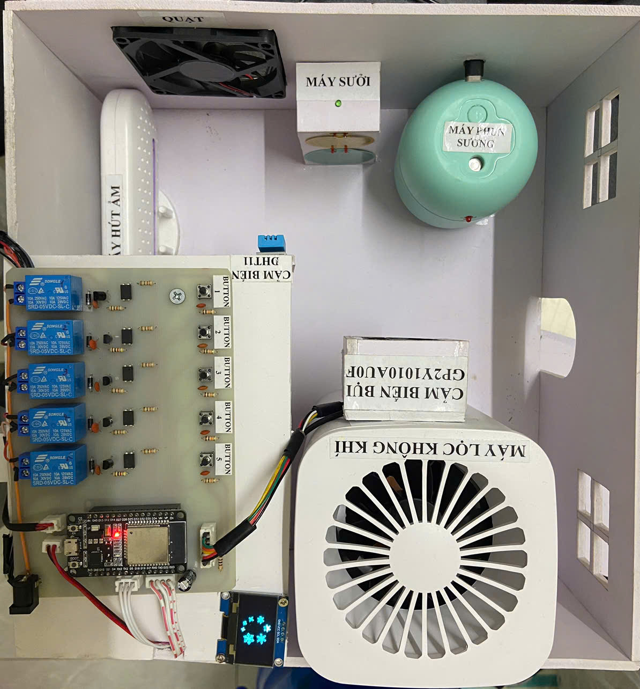
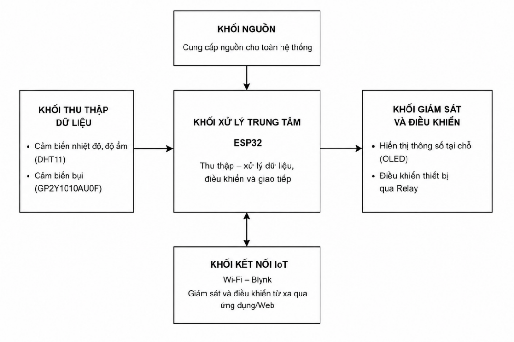
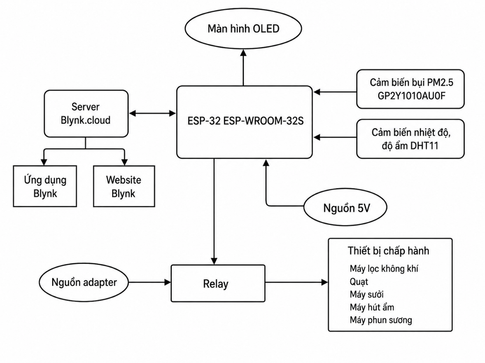
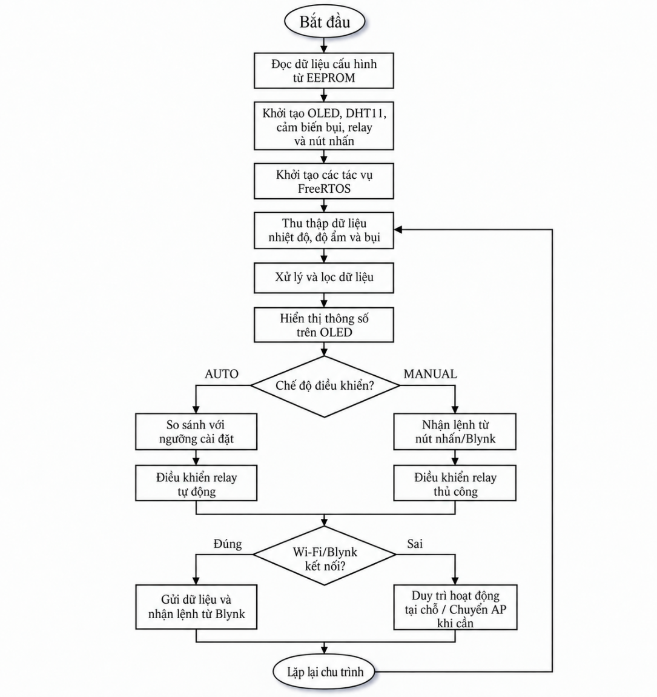

# Hệ thống giám sát và kiểm soát chất lượng không khí trong nhà

Đồ án xây dựng hệ thống sử dụng ESP32 để giám sát nhiệt độ, độ ẩm và chất lượng không khí trong nhà. Dữ liệu được hiển thị trực tiếp trên màn hình OLED và gửi lên nền tảng Blynk thông qua kết nối Wi-Fi.

Hệ thống hỗ trợ điều khiển các thiết bị điện theo hai chế độ: tự động dựa trên ngưỡng cài đặt và điều khiển thủ công bằng nút nhấn hoặc thông qua Blynk.

## Hình ảnh mô hình



## Chức năng chính

- Đo nhiệt độ và độ ẩm bằng cảm biến DHT11.
- Đo bụi bằng cảm biến GP2Y1010AU0F.
- Hiển thị thông số trên màn hình OLED.
- Gửi dữ liệu lên nền tảng Blynk thông qua Wi-Fi.
- Điều khiển 5 kênh relay.
- Hỗ trợ chế độ điều khiển tự động và thủ công.
- Điều khiển thủ công bằng nút nhấn hoặc Blynk.
- Cấu hình Wi-Fi, Blynk và các ngưỡng điều khiển thông qua giao diện Web.
- Lưu thông tin cấu hình bằng EEPROM.
- Sử dụng các task FreeRTOS để xử lý cảm biến, hiển thị, mạng và điều khiển.

## Phần cứng

| Thành phần | Mô tả |
|---|---|
| Vi điều khiển | ESP32 ESP-WROOM-32S |
| Cảm biến nhiệt độ, độ ẩm | DHT11 |
| Cảm biến bụi | GP2Y1010AU0F |
| Màn hình | OLED 1.3 inch, 128×64, giao tiếp I2C |
| Bộ điều khiển | Relay 5V, 5 kênh |
| Nút nhấn | 5 nút nhấn cơ học |
| Kết nối | Wi-Fi |
| Nền tảng IoT | Blynk IoT |

## Sơ đồ hệ thống

### Sơ đồ khối tổng quan



### Sơ đồ khối chi tiết



### Lưu đồ hoạt động chương trình



## Sơ đồ chân kết nối

| Thiết bị | Chân ESP32 |
|---|---|
| DHT11 | GPIO 18 |
| GP2Y1010AU0F - điều khiển LED | GPIO 23 |
| GP2Y1010AU0F - ngõ ra analog | GPIO 36 |
| OLED - SDA | GPIO 21 |
| OLED - SCL | GPIO 22 |
| Relay 1 đến Relay 5 | GPIO 25, 26, 27, 14, 13 |
| Nút nhấn 1 đến nút nhấn 5 | GPIO 33, 32, 35, 34, 39 |

## Phần mềm sử dụng

- Arduino IDE 2.3.10
- Ngôn ngữ C/C++
- ESP32 Arduino Core
- FreeRTOS
- Wi-Fi
- Blynk IoT
- AP Mode
- WebServer
- EEPROM

## Thư viện cần thiết

- Blynk
- DHT sensor library
- Adafruit GFX Library
- Adafruit SH110X
- AsyncTCP
- ESPAsyncWebServer
- Arduino_JSON

## Cấu trúc mã nguồn

Mã nguồn chương trình được lưu trong thư mục `firmware/`.

```text
firmware/
├── code_DATN.ino
├── data_config.h
├── icon.h
└── index_html.h
```
## Tác giả

**Ngô Văn Quý**

Đồ án tốt nghiệp ngành **Công Nghệ Kỹ Thuật Máy Tính**.
